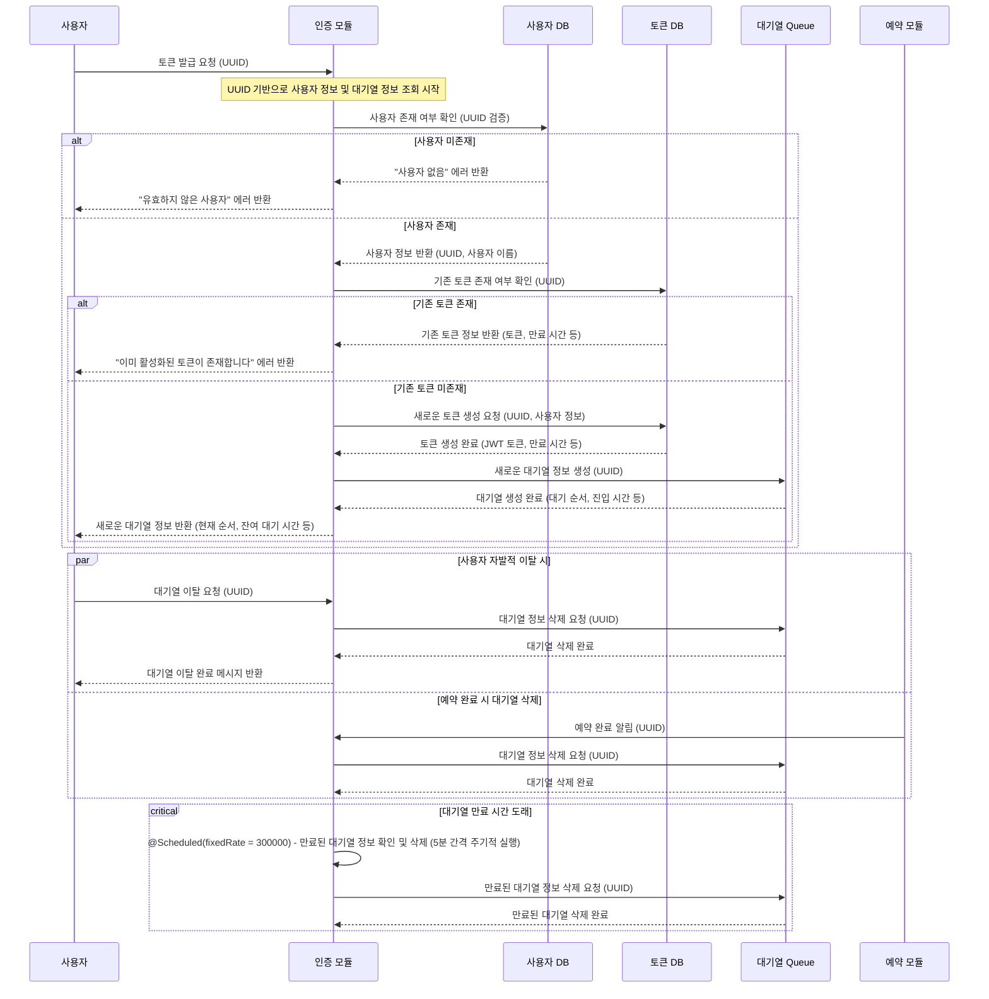
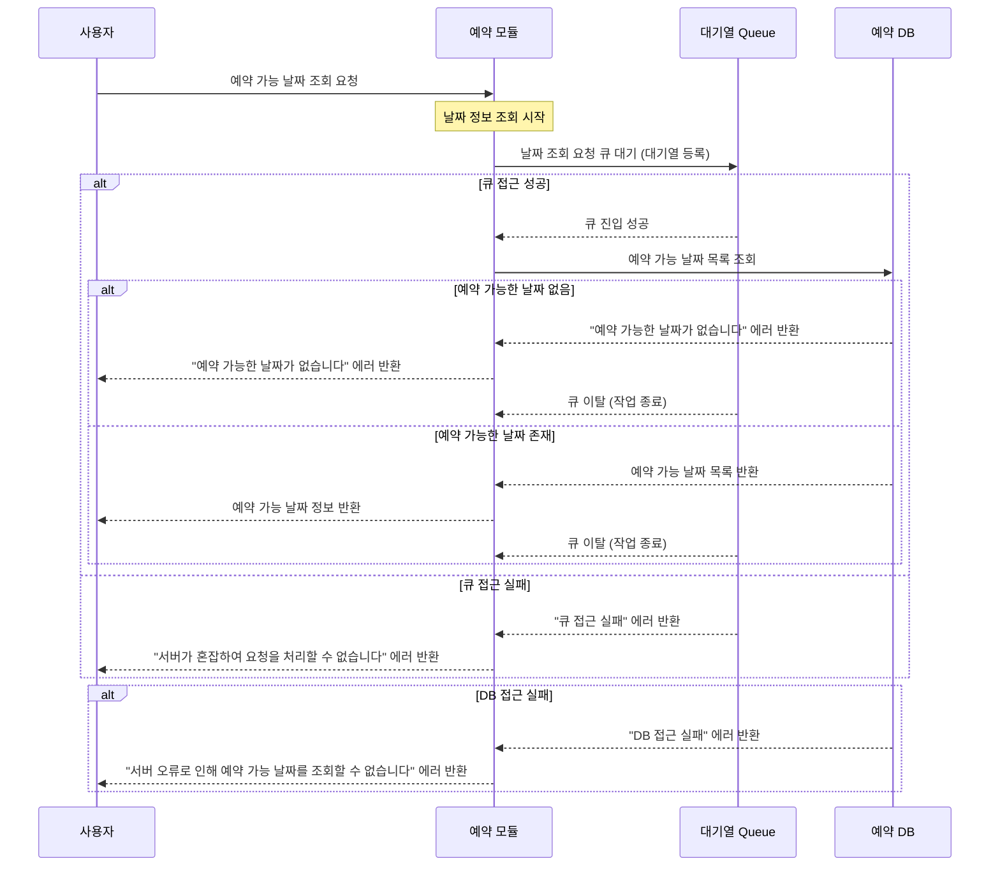
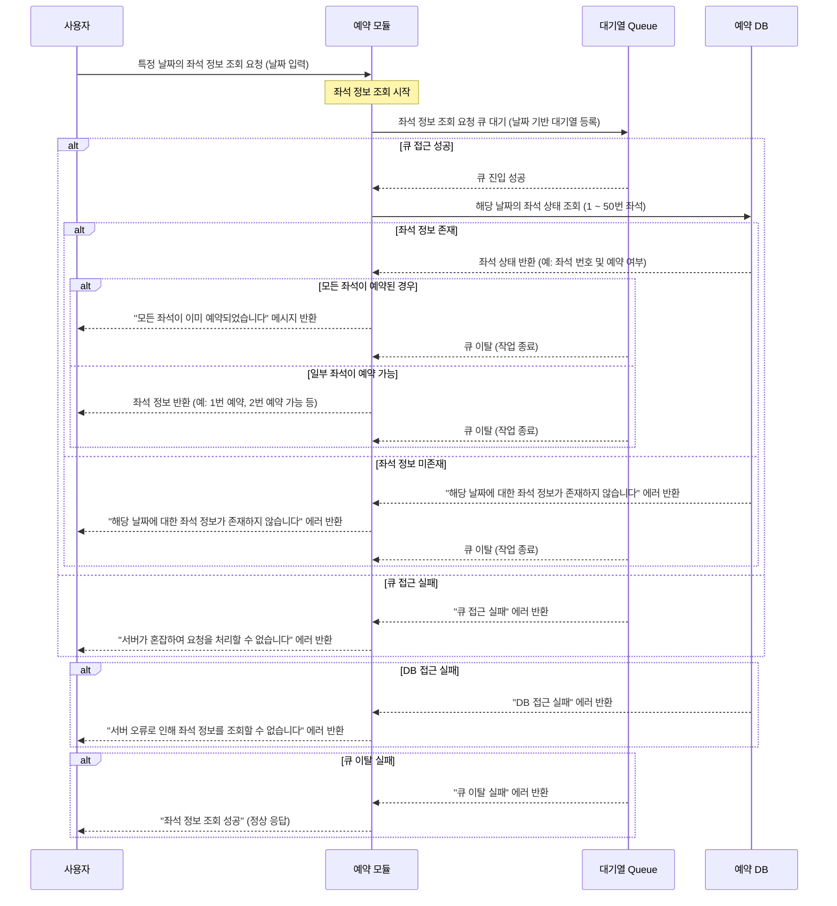
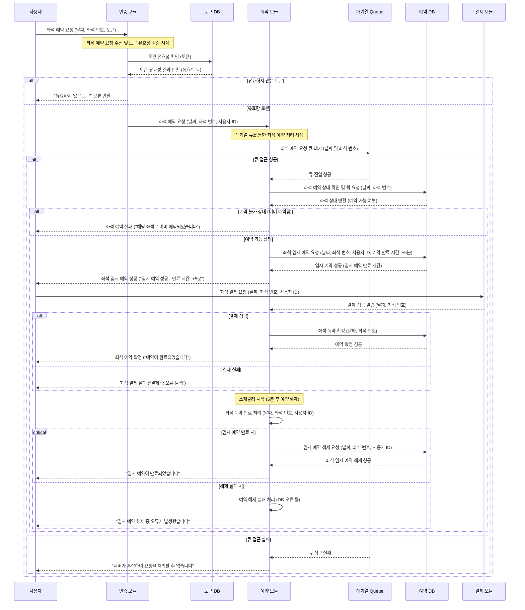
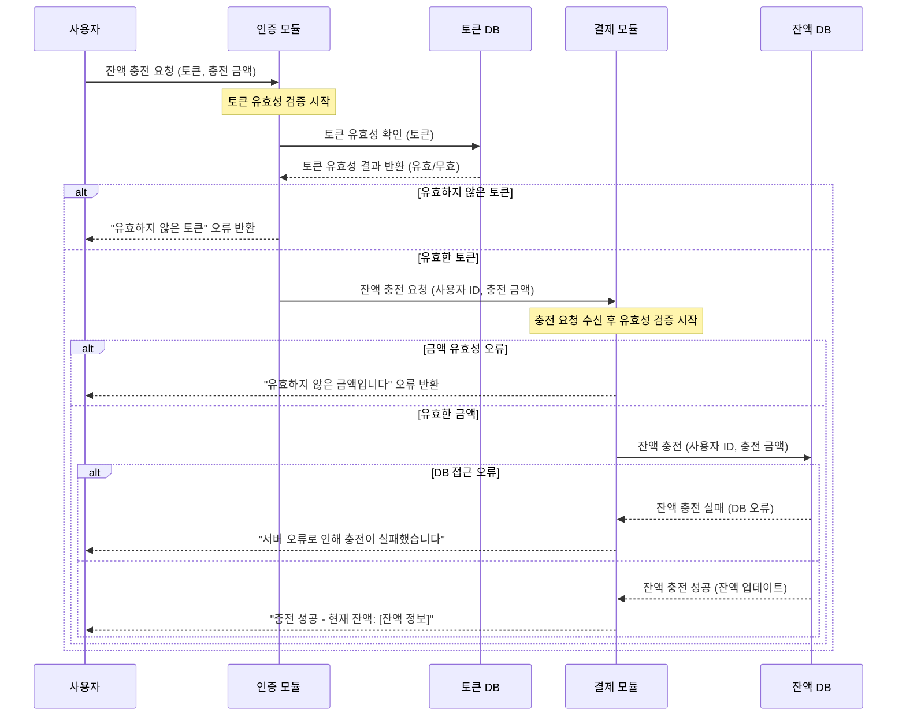
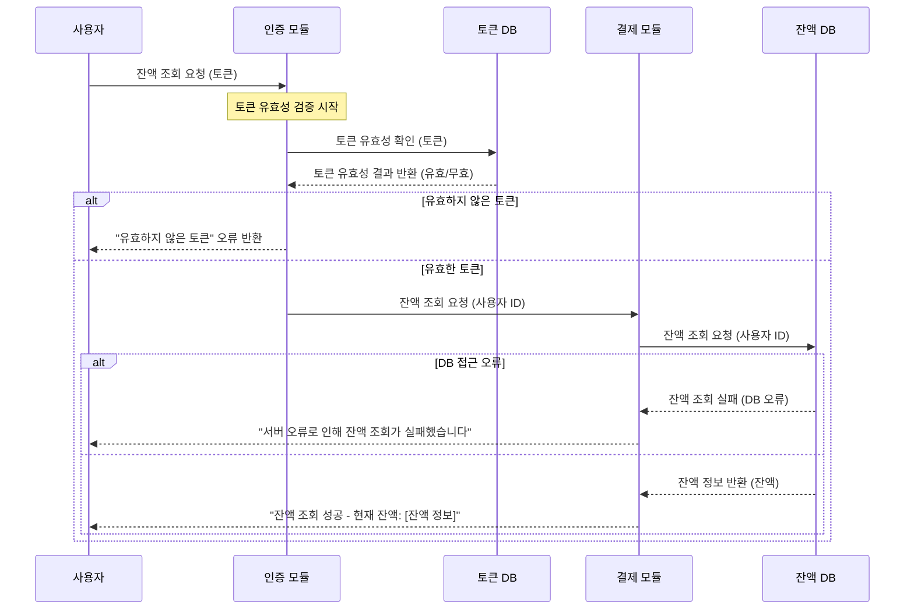
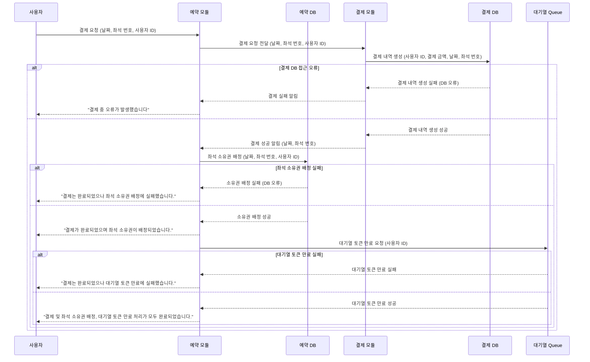

## 📑 프로젝트 소개
> 💡 **목표**: TDD와 클린 아키텍처 원칙을 적용하여, 다수의 사용자가 동시에 접근할 수 있는 콘서트 좌석 예약 서비스에서 대기열 관리, 동시성 제어, 잔액 충전 및 결제 기능을 안정적으로 구현하고, 이를 통해 실무에 가까운 서버 개발 경험을 쌓는 것을 목표로 합니다.

---
## 📅 프로젝트 전체 일정

## 📅 프로젝트 단계별 진행 상황 (Milestone)

---
아래는 리드미에 포함할 수 있는 시퀀스 다이어그램 섹션 예시입니다. Mermaid를 이용하여 시퀀스 다이어그램을 작성할 수 있으며, 다이어그램 코드를 리드미에 추가하여 프로젝트의 동작 흐름을 시각적으로 설명할 수 있습니다.

---

# 📊 시퀀스 다이어그램

프로젝트의 주요 기능 및 흐름을 이해하기 위해 각 API의 시퀀스 다이어그램을 작성하였습니다. 아래 다이어그램들은 API의 호출 흐름, 사용자 요청 처리, 예외 처리 시나리오를 시각적으로 표현한 것입니다.

## 🏷️ (1) 유저 토큰 발급 API 시퀀스 다이어그램

## 🏷️ (2) 예약 가능 날짜 조회 API 시퀀스 다이어그램

## 🏷️ (3) 특정 날짜 좌석 정보 조회 API 시퀀스 다이어그램

## 🏷️ (4) 좌석 예약 요청 API 시퀀스 다이어그램

## 🏷️ (5) 잔액 충전 API 시퀀스 다이어그램

## 🏷️ (6) 사용자 잔액 조회 요청 API 시퀀스 다이어그램

## 🏷️ (7) 결제 API 시퀀스 다이어그램

