## 📑 프로젝트 소개
> 💡 **목표**: TDD와 클린 아키텍처 원칙을 적용하여, 다수의 사용자가 동시에 접근할 수 있는 콘서트 좌석 예약 서비스에서 대기열 관리, 동시성 제어, 잔액 충전 및 결제 기능을 안정적으로 구현하고, 이를 통해 실무에 가까운 서버 개발 경험을 쌓는 것을 목표로 합니다.

---
## 📅 프로젝트 전체 일정

---

# 📊 시퀀스 다이어그램

프로젝트의 주요 기능 및 흐름을 이해하기 위해 각 API의 시퀀스 다이어그램을 작성하였습니다. 아래 다이어그램들은 API의 호출 흐름, 사용자 요청 처리, 예외 처리 시나리오를 시각적으로 표현한 것입니다.

## 🏷️ (1) 유저 토큰 발급 API 시퀀스 다이어그램
```mermaid
    sequenceDiagram
    participant User as 사용자
    participant AuthServer as 인증 모듈
    participant UserDB as 사용자 DB
    participant TokenDB as 토큰 DB
    participant QueueDB as 대기열 Queue
    participant ReservationSystem as 예약 모듈
    
    %% 1️⃣ 사용자 대기열 토큰 발급 및 실시간 정보 조회 최적화 시퀀스
    User->>AuthServer: 토큰 발급 요청 (UUID)
    Note over AuthServer: UUID 기반으로 사용자 정보 및 대기열 정보 조회 시작
    
    %% 2️⃣ 사용자 정보 조회
    AuthServer->>UserDB: 사용자 존재 여부 확인 (UUID 검증)
    
    alt 사용자 미존재
    %% 3️⃣ 유효하지 않은 사용자일 경우
    UserDB-->>AuthServer: "사용자 없음" 에러 반환
    AuthServer-->>User: "유효하지 않은 사용자" 에러 반환
    else 사용자 존재
    %% 4️⃣ 사용자가 존재하는 경우, 사용자 정보 반환
    UserDB-->>AuthServer: 사용자 정보 반환 (UUID, 사용자 이름)
    
        %% 5️⃣ 기존 토큰 존재 여부 확인
        AuthServer->>TokenDB: 기존 토큰 존재 여부 확인 (UUID)
        
        alt 기존 토큰 존재
            %% 6️⃣ 기존 토큰 정보 반환 및 에러 처리
            TokenDB-->>AuthServer: 기존 토큰 정보 반환 (토큰, 만료 시간 등)
            AuthServer-->>User: "이미 활성화된 토큰이 존재합니다" 에러 반환
        else 기존 토큰 미존재
            %% 7️⃣ 토큰 생성
            AuthServer->>TokenDB: 새로운 토큰 생성 요청 (UUID, 사용자 정보)
            TokenDB-->>AuthServer: 토큰 생성 완료 (JWT 토큰, 만료 시간 등)
    
            %% 11️⃣ 새로운 대기열 정보 생성
            AuthServer->>QueueDB: 새로운 대기열 정보 생성 (UUID)
            QueueDB-->>AuthServer: 대기열 생성 완료 (대기 순서, 진입 시간 등)
    
            %% 12️⃣ 사용자에게 새로운 대기열 정보 반환
            AuthServer-->>User: 새로운 대기열 정보 반환 (현재 순서, 잔여 대기 시간 등)
        end
    end
    
    %% 추가 시나리오: 대기열 토큰 삭제 시나리오
    par 사용자 자발적 이탈 시
    User->>AuthServer: 대기열 이탈 요청 (UUID)
    AuthServer->>QueueDB: 대기열 정보 삭제 요청 (UUID)
    QueueDB-->>AuthServer: 대기열 삭제 완료
    AuthServer-->>User: 대기열 이탈 완료 메시지 반환
    and 예약 완료 시 대기열 삭제
    ReservationSystem->>AuthServer: 예약 완료 알림 (UUID)
    AuthServer->>QueueDB: 대기열 정보 삭제 요청 (UUID)
    QueueDB-->>AuthServer: 대기열 삭제 완료
    end
    
    %% 추가 시나리오: 대기열 만료 시간 도래 시 대기열 삭제
    critical 대기열 만료 시간 도래
    AuthServer->>AuthServer: @Scheduled(fixedRate = 300000) - 만료된 대기열 정보 확인 및 삭제 (5분 간격 주기적 실행)
    AuthServer->>QueueDB: 만료된 대기열 정보 삭제 요청 (UUID)
    QueueDB-->>AuthServer: 만료된 대기열 삭제 완료
    end
```

## 🏷️ (2) 예약 가능 날짜 조회 API 시퀀스 다이어그램
```mermaid
  sequenceDiagram
  participant User as 사용자
  participant ReservationServer as 예약 모듈
  participant ReservationDB as 예약 DB
  
  %% 1️⃣ 예약 가능 날짜 조회 API
  User->>ReservationServer: 예약 가능 날짜 조회 요청
  Note over ReservationServer: 날짜 정보 조회 시작
  
  %% 예약 가능 날짜 조회 로직
  ReservationServer->>ReservationDB: 예약 가능 날짜 목록 조회
  alt 예약 가능한 날짜 없음
  %% 예약 가능한 날짜가 없는 경우
  ReservationDB-->>ReservationServer: "예약 가능한 날짜가 없습니다" 에러 반환
  ReservationServer-->>User: "예약 가능한 날짜가 없습니다" 에러 반환
  else 예약 가능한 날짜 존재
  %% 예약 가능한 날짜가 존재하는 경우
  ReservationDB-->>ReservationServer: 예약 가능 날짜 목록 반환
  ReservationServer-->>User: 예약 가능 날짜 정보 반환
  end

  %% 예약 가능 날짜 조회 중 DB 접근 실패 시 처리
  alt DB 접근 실패
  ReservationDB-->>ReservationServer: "DB 접근 실패" 에러 반환
  ReservationServer-->>User: "서버 오류로 인해 예약 가능 날짜를 조회할 수 없습니다" 에러 반환
  end
```

## 🏷️ (3) 특정 날짜 좌석 정보 조회 API 시퀀스 다이어그램
```mermaid
    sequenceDiagram
  participant User as 사용자
  participant ReservationServer as 예약 모듈
  participant ReservationDB as 예약 DB
  
  %% 2️⃣ 특정 날짜 좌석 정보 조회 API
  User->>ReservationServer: 특정 날짜의 좌석 정보 조회 요청 (날짜 입력)
  Note over ReservationServer: 좌석 정보 조회 시작
  
  %% 예약 모듈에서 좌석 정보 조회
  ReservationServer->>ReservationDB: 해당 날짜의 좌석 상태 조회 (1 ~ 50번 좌석)
  
  alt 좌석 정보 존재
      %% 좌석 정보가 존재하는 경우
      ReservationDB-->>ReservationServer: 좌석 상태 반환 (예: 좌석 번호 및 예약 여부)
      
      alt 모든 좌석이 예약된 경우
          ReservationServer-->>User: "모든 좌석이 이미 예약되었습니다" 메시지 반환
      else 일부 좌석이 예약 가능
          %% 사용자에게 좌석 정보 반환
          ReservationServer-->>User: 좌석 정보 반환 (예: 1번 예약, 2번 예약 가능 등)
      end
  else 좌석 정보 미존재
      %% 좌석 정보가 존재하지 않는 경우
      ReservationDB-->>ReservationServer: "해당 날짜에 대한 좌석 정보가 존재하지 않습니다" 에러 반환
      ReservationServer-->>User: "해당 날짜에 대한 좌석 정보가 존재하지 않습니다" 에러 반환
  end
  
  %% 예약 가능한 좌석 조회 중 DB 접근 실패 시 처리
  alt DB 접근 실패
  ReservationDB-->>ReservationServer: "DB 접근 실패" 에러 반환
  ReservationServer-->>User: "서버 오류로 인해 좌석 정보를 조회할 수 없습니다" 에러 반환
  end
```

## 🏷️ (4) 좌석 예약 요청 API 시퀀스 다이어그램
```mermaid
  sequenceDiagram
  participant User as 사용자
  participant AuthServer as 인증 모듈
  participant TokenDB as 토큰 DB
  participant ReservationServer as 예약 모듈
  participant QueueSystem as 대기열 Queue
  participant ReservationDB as 예약 DB
  participant PaymentServer as 결제 모듈
  
  %% 1️⃣ 사용자 좌석 예약 요청 시나리오
  User->>AuthServer: 좌석 예약 요청 (날짜, 좌석 번호, 토큰)
  Note over AuthServer: 좌석 예약 요청 수신 및 토큰 유효성 검증 시작
  
  %% 2️⃣ 토큰 유효성 검증
  AuthServer->>TokenDB: 토큰 유효성 확인 (토큰)
  TokenDB-->>AuthServer: 토큰 유효성 결과 반환 (유효/무효)
  
  alt 유효하지 않은 토큰
  %% 3️⃣ 유효하지 않은 토큰일 경우 오류 반환
  AuthServer-->>User: "유효하지 않은 토큰" 오류 반환
  else 유효한 토큰
  %% 4️⃣ 예약 서버로 유효한 요청 전달
  AuthServer->>ReservationServer: 좌석 예약 요청 (날짜, 좌석 번호, 사용자 ID)
  Note over ReservationServer: 대기열 큐를 통한 좌석 예약 처리 시작
  
      %% 5️⃣ 대기열 큐에 접근하여 자원 경합 방지
      ReservationServer->>QueueSystem: 좌석 예약 요청 큐 대기 (날짜 및 좌석 번호)
      
      alt 큐 접근 성공
          QueueSystem-->>ReservationServer: 큐 진입 성공
          
          %% 6️⃣ 좌석 예약 상태 확인 및 Pessimistic Lock 획득
          ReservationServer->>ReservationDB: 좌석 예약 상태 확인 및 락 요청 (날짜, 좌석 번호)
          ReservationDB-->>ReservationServer: 좌석 상태 반환 (예약 가능 여부)
  
          alt 예약 불가 상태 (이미 예약됨)
              %% 7️⃣ 좌석이 이미 임시 예약된 경우
              ReservationServer-->>User: 좌석 예약 실패 ("해당 좌석은 이미 예약되었습니다")
          else 예약 가능 상태
              %% 8️⃣ 좌석 임시 예약 처리
              ReservationServer->>ReservationDB: 좌석 임시 예약 요청 (날짜, 좌석 번호, 사용자 ID, 예약 만료 시간: +5분)
              ReservationDB-->>ReservationServer: 임시 예약 성공 (임시 예약 만료 시간)
  
              %% 9️⃣ 사용자에게 임시 예약 성공 응답
              ReservationServer-->>User: 좌석 임시 예약 성공 ("임시 예약 성공 - 만료 시간: +5분")
  
              %% 🔟 결제 요청 발생 시 처리
              User->>PaymentServer: 좌석 결제 요청 (날짜, 좌석 번호, 사용자 ID)
              PaymentServer-->>ReservationServer: 결제 성공 알림 (날짜, 좌석 번호)
              
              alt 결제 성공
                  ReservationServer->>ReservationDB: 좌석 예약 확정 (날짜, 좌석 번호)
                  ReservationDB-->>ReservationServer: 예약 확정 성공
                  ReservationServer-->>User: 좌석 예약 확정 ("예약이 완료되었습니다")
              else 결제 실패
                  ReservationServer-->>User: 좌석 결제 실패 ("결제 중 오류 발생")
              end
  
              %% 🔟 스케줄러로 임시 예약 만료 처리
              Note over ReservationServer: 스케줄러 시작 (5분 후 예약 해제)
  
              %% 11️⃣ 자기 자신에게 예약 해제 메시지 전달
              ReservationServer->>ReservationServer: 좌석 예약 만료 처리 (날짜, 좌석 번호, 사용자 ID)
  
              critical 임시 예약 만료 시
                  ReservationServer->>ReservationDB: 임시 예약 해제 요청 (날짜, 좌석 번호, 사용자 ID)
                  ReservationDB-->>ReservationServer: 좌석 임시 예약 해제 성공
                  ReservationServer-->>User: "임시 예약이 만료되었습니다"
              option 해제 실패 시
                  ReservationServer->>ReservationServer: 예약 해제 실패 처리 (DB 오류 등)
                  ReservationServer-->>User: "임시 예약 해제 중 오류가 발생했습니다"
              end
          end
      else 큐 접근 실패
          %% 12️⃣ 큐 접근 실패 시 오류 반환
          QueueSystem-->>ReservationServer: 큐 접근 실패
          ReservationServer-->>User: "서버가 혼잡하여 요청을 처리할 수 없습니다"
      end
  end
```

## 🏷️ (5) 잔액 충전 API 시퀀스 다이어그램
```mermaid
  sequenceDiagram
  participant User as 사용자
  participant AuthServer as 인증 모듈
  participant TokenDB as 토큰 DB
  participant ReservationServer as 결제 모듈
  participant BalanceDB as 잔액 DB
  
  %% 1️⃣ 사용자 잔액 충전 요청 시나리오
  User->>AuthServer: 잔액 충전 요청 (토큰, 충전 금액)
  Note over AuthServer: 토큰 유효성 검증 시작
  
  %% 2️⃣ 토큰 유효성 검증
  AuthServer->>TokenDB: 토큰 유효성 확인 (토큰)
  TokenDB-->>AuthServer: 토큰 유효성 결과 반환 (유효/무효)
  
  alt 유효하지 않은 토큰
  %% 3️⃣ 유효하지 않은 토큰일 경우
  AuthServer-->>User: "유효하지 않은 토큰" 오류 반환
  else 유효한 토큰
  %% 4️⃣ 예약 서버로 유효한 요청 전달
  AuthServer->>ReservationServer: 잔액 충전 요청 (사용자 ID, 충전 금액)
  Note over ReservationServer: 충전 요청 수신 후 유효성 검증 시작
  
      %% 5️⃣ 충전 금액 유효성 검증
      alt 금액 유효성 오류
          ReservationServer-->>User: "유효하지 않은 금액입니다" 오류 반환
      else 유효한 금액
          %% 6️⃣ 잔액 DB에 충전 요청
          ReservationServer->>BalanceDB: 잔액 충전 (사용자 ID, 충전 금액)
          alt DB 접근 오류
              %% 7️⃣ 충전 중 DB 접근 오류 발생
              BalanceDB-->>ReservationServer: 잔액 충전 실패 (DB 오류)
              ReservationServer-->>User: "서버 오류로 인해 충전이 실패했습니다"
          else
              %% 8️⃣ 충전 성공
              BalanceDB-->>ReservationServer: 잔액 충전 성공 (잔액 업데이트)
              ReservationServer-->>User: "충전 성공 - 현재 잔액: [잔액 정보]"
          end
      end
  end
```

## 🏷️ (6) 사용자 잔액 조회 요청 API 시퀀스 다이어그램
```mermaid
  sequenceDiagram
  %% 참가자 정의
  participant User as 사용자
  participant AuthServer as 인증 모듈
  participant TokenDB as 토큰 DB
  participant ReservationServer as 결제 모듈
  participant BalanceDB as 잔액 DB
  
  %% 1️⃣ 사용자 잔액 조회 요청 시나리오
  User->>AuthServer: 잔액 조회 요청 (토큰)
  Note over AuthServer: 토큰 유효성 검증 시작
  
  %% 2️⃣ 토큰 유효성 검증
  AuthServer->>TokenDB: 토큰 유효성 확인 (토큰)
  TokenDB-->>AuthServer: 토큰 유효성 결과 반환 (유효/무효)
  
  alt 유효하지 않은 토큰
  %% 3️⃣ 유효하지 않은 토큰일 경우
  AuthServer-->>User: "유효하지 않은 토큰" 오류 반환
  else 유효한 토큰
  %% 4️⃣ 예약 서버로 유효한 요청 전달
  AuthServer->>ReservationServer: 잔액 조회 요청 (사용자 ID)
  
      %% 5️⃣ 잔액 조회 요청 처리
      ReservationServer->>BalanceDB: 잔액 조회 요청 (사용자 ID)
      alt DB 접근 오류
          %% 6️⃣ 잔액 조회 중 DB 접근 오류 발생
          BalanceDB-->>ReservationServer: 잔액 조회 실패 (DB 오류)
          ReservationServer-->>User: "서버 오류로 인해 잔액 조회가 실패했습니다"
      else
          %% 7️⃣ 잔액 조회 성공
          BalanceDB-->>ReservationServer: 잔액 정보 반환 (잔액)
          ReservationServer-->>User: "잔액 조회 성공 - 현재 잔액: [잔액 정보]"
      end
  end
```

## 🏷️ (7) 결제 API 시퀀스 다이어그램
```mermaid
  sequenceDiagram
    participant User as 사용자
    participant ReservationServer as 예약 모듈
    participant ReservationDB as 예약 DB
    participant PaymentServer as 결제 모듈
    participant PaymentDB as 결제 DB
    participant QueueSystem as 대기열 Queue
    
    %% 1️⃣ 사용자 결제 요청 시나리오
    User->>ReservationServer: 결제 요청 (날짜, 좌석 번호, 사용자 ID)
    ReservationServer->>PaymentServer: 결제 요청 전달 (날짜, 좌석 번호, 사용자 ID)
    
    %% 2️⃣ 결제 처리 및 결제 내역 생성
    PaymentServer->>PaymentDB: 결제 내역 생성 (사용자 ID, 결제 금액, 날짜, 좌석 번호)
    
    alt 결제 DB 접근 오류
        PaymentDB-->>PaymentServer: 결제 내역 생성 실패 (DB 오류)
        PaymentServer-->>ReservationServer: 결제 실패 알림
        ReservationServer-->>User: "결제 중 오류가 발생했습니다"
    else
        PaymentDB-->>PaymentServer: 결제 내역 생성 성공
        PaymentServer-->>ReservationServer: 결제 성공 알림 (날짜, 좌석 번호)

        %% 3️⃣ 좌석 소유권 배정 처리
        ReservationServer->>ReservationDB: 좌석 소유권 배정 (날짜, 좌석 번호, 사용자 ID)
        
        alt 좌석 소유권 배정 실패
            ReservationDB-->>ReservationServer: 소유권 배정 실패 (DB 오류)
            ReservationServer-->>User: "결제는 완료되었으나 좌석 소유권 배정에 실패했습니다."
        else 
            ReservationDB-->>ReservationServer: 소유권 배정 성공
            ReservationServer-->>User: "결제가 완료되었으며 좌석 소유권이 배정되었습니다."

            %% 4️⃣ 대기열 토큰 만료 처리
            ReservationServer->>QueueSystem: 대기열 토큰 만료 요청 (사용자 ID)
            
            alt 대기열 토큰 만료 실패
                QueueSystem-->>ReservationServer: 대기열 토큰 만료 실패
                ReservationServer-->>User: "결제는 완료되었으나 대기열 토큰 만료에 실패했습니다."
            else
                QueueSystem-->>ReservationServer: 대기열 토큰 만료 성공
                ReservationServer-->>User: "결제 및 좌석 소유권 배정, 대기열 토큰 만료 처리가 모두 완료되었습니다."
            end
        end
    end
```
---
# 📈 플로우 차트

## 🏷️ (1) 유저 토큰 발급 API 플로우 차트
```mermaid
flowchart TD
    %% 노드 정의
    Start["Start"]
    TokenRequest["사용자가 토큰 발급 요청 (UUID)"]
    CheckUser["인증 모듈: 사용자 존재 여부 확인"]
    UserExists{"사용자가 존재합니까?"}
    InvalidUser["인증 모듈: '유효하지 않은 사용자' 에러 반환"]
    GetUserInfo["인증 모듈: 사용자 정보 조회"]
    CheckToken["인증 모듈: 기존 토큰 존재 여부 확인"]
    TokenExists{"기존 토큰이 존재합니까?"}
    TokenError["인증 모듈: '이미 활성화된 토큰이 존재합니다' 에러 반환"]
    CreateToken["인증 모듈: 새로운 토큰 생성"]
    CreateQueue["인증 모듈: 새로운 대기열 정보 생성"]
    ReturnInfo["인증 모듈: 새로운 토큰 및 대기열 정보 반환"]
    End["End"]
    
    %% 흐름 연결
    Start --> TokenRequest
    TokenRequest --> CheckUser
    CheckUser --> UserExists
    UserExists -- "No" --> InvalidUser --> End
    UserExists -- "Yes" --> GetUserInfo --> CheckToken --> TokenExists
    TokenExists -- "Yes" --> TokenError --> End
    TokenExists -- "No" --> CreateToken --> CreateQueue --> ReturnInfo --> End
```

## 🏷️ (2) 예약 가능 날짜 조회 API 플로우 차트
```mermaid
flowchart TD
    %% 노드 정의
    Start["Start"]
    A_RequestDates["사용자: 예약 가능 날짜 조회 요청"]
    B_StartLookup["예약 모듈: 날짜 정보 조회 시작"]
    F_QueryDates["예약 모듈: 예약 가능 날짜 목록 조회"]
    G_DBAccessFailed{"DB 접근 실패 여부"}
    H_DatesAvailable{"예약 가능한 날짜 존재 여부"}
    I_NoDates["예약 모듈: '예약 가능한 날짜가 없습니다' 에러 반환"]
    J_ReturnDates["예약 모듈: 예약 가능 날짜 정보 반환"]
    End["End"]

    %% 흐름 연결
    Start --> A_RequestDates
    A_RequestDates --> B_StartLookup
    B_StartLookup --> F_QueryDates

    F_QueryDates --> G_DBAccessFailed
    G_DBAccessFailed -- "예" --> I_NoDates --> End
    G_DBAccessFailed -- "아니오" --> H_DatesAvailable

    H_DatesAvailable -- "예" --> J_ReturnDates --> End
    H_DatesAvailable -- "아니오" --> I_NoDates --> End
```

## 🏷️ (3) 특정 날짜 좌석 정보 조회 API 플로우 차트
```mermaid
flowchart TD
    %% 노드 정의
    Start["Start"]
    A_RequestSeats["사용자: 특정 날짜의 좌석 정보 조회 요청 (날짜 입력)"]
    B_StartLookup["예약 모듈: 좌석 정보 조회 시작"]
    C_QuerySeats["예약 모듈: 해당 날짜의 좌석 상태 조회 (1 ~ 50번 좌석)"]
    D_DBAccessFailed{"DB 접근 실패 여부"}
    E_ServerError["예약 모듈: '서버 오류로 인해 좌석 정보를 조회할 수 없습니다' 에러 반환"]
    F_SeatsAvailable{"좌석 정보 존재 여부"}
    G_NoSeats["예약 모듈: '해당 날짜에 대한 좌석 정보가 존재하지 않습니다' 에러 반환"]
    H_ReturnAllSeatsReserved["예약 모듈: '모든 좌석이 이미 예약되었습니다' 메시지 반환"]
    I_ReturnAvailableSeats["예약 모듈: 좌석 정보 반환 (예: 1번 예약, 2번 예약 가능 등)"]
    End["End"]

    %% 흐름 연결
    Start --> A_RequestSeats
    A_RequestSeats --> B_StartLookup
    B_StartLookup --> C_QuerySeats

    C_QuerySeats --> D_DBAccessFailed
    D_DBAccessFailed -- "예" --> E_ServerError --> End
    D_DBAccessFailed -- "아니오" --> F_SeatsAvailable

    F_SeatsAvailable -- "예" --> H_AllSeatsReserved{"모든 좌석이 예약되었는지 여부"}
    H_AllSeatsReserved -- "예" --> H_ReturnAllSeatsReserved --> End
    H_AllSeatsReserved -- "아니오" --> I_ReturnAvailableSeats --> End

    F_SeatsAvailable -- "아니오" --> G_NoSeats --> End

```

## 🏷️ (4) 좌석 예약 요청 API 플로우 차트
```mermaid
flowchart TD
    %% 노드 정의
    Start["Start"]
    A_RequestReservation["사용자: 좌석 예약 요청 (날짜, 좌석 번호, 토큰)"]
    B_TokenValidation["인증 모듈: 토큰 유효성 검증"]
    C_TokenValid{"토큰이 유효합니까?"}
    D_InvalidToken["인증 모듈: '유효하지 않은 토큰' 오류 반환"]
    E_ForwardRequest["인증 모듈: 예약 모듈로 요청 전달"]
    F_QueueWait["예약 모듈: 좌석 예약 요청 큐 대기"]
    G_QueueAccess{"큐 접근 성공 여부"}
    H_QueueFail["예약 모듈: '서버가 혼잡하여 요청을 처리할 수 없습니다' 오류 반환"]
    I_CheckSeat["예약 모듈: 좌석 예약 상태 확인 및 락 요청"]
    J_SeatAvailable{"좌석이 예약 가능합니까?"}
    K_SeatUnavailable["예약 모듈: '해당 좌석은 이미 예약되었습니다' 오류 반환"]
    L_TemporaryReserve["예약 모듈: 좌석 임시 예약 처리 (5분)"]
    M_TempReserveSuccess["예약 모듈: 좌석 임시 예약 성공 응답 반환"]
    N_PaymentRequest["사용자: 결제 요청"]
    O_PaymentResult["결제 모듈: 결제 결과 알림"]
    P_PaymentSuccess{"결제가 성공하였습니까?"}
    Q_ReservationConfirm["예약 모듈: 좌석 예약 확정"]
    R_ReservationSuccess["예약 모듈: '예약이 완료되었습니다' 응답"]
    S_PaymentFail["예약 모듈: '결제 중 오류 발생' 응답"]
    T_StartTimer["예약 모듈: 타이머 시작 (5분 후 예약 해제)"]
    U_TimerExpired["타이머 만료 (임시 예약 해제)"]
    V_ReleaseSeat["예약 모듈: 임시 예약 해제"]
    W_End["End"]

    %% 흐름 연결
    Start --> A_RequestReservation
    A_RequestReservation --> B_TokenValidation
    B_TokenValidation --> C_TokenValid

    C_TokenValid -- "아니오" --> D_InvalidToken --> W_End
    C_TokenValid -- "예" --> E_ForwardRequest

    E_ForwardRequest --> F_QueueWait
    F_QueueWait --> G_QueueAccess

    G_QueueAccess -- "아니오" --> H_QueueFail --> W_End
    G_QueueAccess -- "예" --> I_CheckSeat

    I_CheckSeat --> J_SeatAvailable
    J_SeatAvailable -- "아니오" --> K_SeatUnavailable --> W_End
    J_SeatAvailable -- "예" --> L_TemporaryReserve

    L_TemporaryReserve --> M_TempReserveSuccess
    M_TempReserveSuccess --> N_PaymentRequest
    N_PaymentRequest --> O_PaymentResult
    O_PaymentResult --> P_PaymentSuccess

    P_PaymentSuccess -- "예" --> Q_ReservationConfirm --> R_ReservationSuccess --> W_End
    P_PaymentSuccess -- "아니오" --> S_PaymentFail --> W_End

    %% 타이머 및 임시 예약 만료 처리
    L_TemporaryReserve --> T_StartTimer
    T_StartTimer --> U_TimerExpired
    U_TimerExpired --> V_ReleaseSeat --> W_End
```

## 🏷️ (5) 잔액 충전 API 플로우 차트
```mermaid
flowchart TD
    %% 노드 정의
    Start["Start"]
    A_RequestRecharge["사용자: 잔액 충전 요청 (토큰, 충전 금액)"]
    B_TokenValidation["인증 모듈: 토큰 유효성 검증 시작"]
    C_ValidateToken["인증 모듈: 토큰 유효성 확인 (토큰)"]
    D_TokenValid{"토큰이 유효합니까?"}
    E_InvalidToken["인증 모듈: '유효하지 않은 토큰' 오류 반환"]
    F_ForwardRequest["인증 모듈: 결제 모듈로 요청 전달 (사용자 ID, 충전 금액)"]
    G_StartValidation["결제 모듈: 충전 요청 수신 후 유효성 검증 시작"]
    H_ValidateAmount["결제 모듈: 충전 금액 유효성 검증"]
    I_AmountValid{"충전 금액이 유효합니까?"}
    J_InvalidAmount["결제 모듈: '유효하지 않은 금액입니다' 오류 반환"]
    K_RechargeRequest["결제 모듈: 잔액 충전 요청 (사용자 ID, 충전 금액)"]
    L_DBAccess["잔액 DB: 잔액 충전 처리"]
    M_DBError{"DB 접근 오류가 발생하였습니까?"}
    N_DBErrorResponse["잔액 DB: 잔액 충전 실패 (DB 오류)"]
    O_ServerError["결제 모듈: '서버 오류로 인해 충전이 실패했습니다' 오류 반환"]
    P_RechargeSuccess["잔액 DB: 잔액 충전 성공 (잔액 업데이트)"]
    Q_ReturnSuccess["결제 모듈: '충전 성공 - 현재 잔액: [잔액 정보]' 응답 반환"]
    End["End"]
    
    %% 흐름 연결
    Start --> A_RequestRecharge
    A_RequestRecharge --> B_TokenValidation
    B_TokenValidation --> C_ValidateToken
    C_ValidateToken --> D_TokenValid

    D_TokenValid -- "아니오" --> E_InvalidToken --> End
    D_TokenValid -- "예" --> F_ForwardRequest

    F_ForwardRequest --> G_StartValidation
    G_StartValidation --> H_ValidateAmount
    H_ValidateAmount --> I_AmountValid

    I_AmountValid -- "아니오" --> J_InvalidAmount --> End
    I_AmountValid -- "예" --> K_RechargeRequest
    K_RechargeRequest --> L_DBAccess
    L_DBAccess --> M_DBError

    M_DBError -- "예" --> N_DBErrorResponse --> O_ServerError --> End
    M_DBError -- "아니오" --> P_RechargeSuccess --> Q_ReturnSuccess --> End
```

## 🏷️ (6) 사용자 잔액 조회 요청 API 플로우 차트
```mermaid
flowchart TD
    %% 노드 정의
    Start["Start"]
    A_RequestBalance["사용자: 잔액 조회 요청 (토큰)"]
    B_TokenValidation["인증 모듈: 토큰 유효성 검증 시작"]
    C_ValidateToken["인증 모듈: 토큰 유효성 확인 (토큰)"]
    D_TokenValid{"토큰이 유효합니까?"}
    E_InvalidToken["인증 모듈: '유효하지 않은 토큰' 오류 반환"]
    F_ForwardRequest["인증 모듈: 예약 모듈로 요청 전달 (사용자 ID)"]
    G_BalanceInquiry["예약 모듈: 잔액 조회 요청 처리"]
    H_DBAccess["예약 모듈: 잔액 DB에 잔액 조회 요청 (사용자 ID)"]
    I_DBError{"DB 접근 오류가 발생하였습니까?"}
    J_DBErrorResponse["예약 모듈: '모듈 오류로 인해 잔액 조회가 실패했습니다' 오류 반환"]
    K_BalanceSuccess["잔액 DB: 잔액 정보 반환 (잔액)"]
    L_ReturnBalance["예약 모듈: '잔액 조회 성공 - 현재 잔액: [잔액 정보]' 응답 반환"]
    End["End"]
    
    %% 흐름 연결
    Start --> A_RequestBalance
    A_RequestBalance --> B_TokenValidation
    B_TokenValidation --> C_ValidateToken
    C_ValidateToken --> D_TokenValid

    D_TokenValid -- "아니오" --> E_InvalidToken --> End
    D_TokenValid -- "예" --> F_ForwardRequest

    F_ForwardRequest --> G_BalanceInquiry
    G_BalanceInquiry --> H_DBAccess
    H_DBAccess --> I_DBError

    I_DBError -- "예" --> J_DBErrorResponse --> End
    I_DBError -- "아니오" --> K_BalanceSuccess --> L_ReturnBalance --> End
```

## 🏷️ (7) 결제 API 플로우 차트
```mermaid
flowchart TD
    %% 노드 정의
    Start["Start"]
    A_RequestPayment["사용자: 결제 요청 (날짜, 좌석 번호, 사용자 ID)"]
    B_PaymentRequest["예약 모듈: 결제 요청 전달"]
    C_CreatePaymentRecord["결제 모듈: 결제 내역 생성"]
    D_PaymentDBError{"결제 DB 접근 오류가 발생하였습니까?"}
    E_PaymentFail["결제 모듈: 결제 실패 알림"]
    F_PaymentSuccess["결제 모듈: 결제 내역 생성 성공"]
    G_PaymentFailResponse["예약 모듈: '결제 중 오류가 발생했습니다' 응답"]
    H_AssignSeatOwnership["예약 모듈: 좌석 소유권 배정"]
    I_SeatAssignmentError{"좌석 소유권 배정에 실패하였습니까?"}
    J_SeatAssignmentFail["예약 모듈: '결제는 완료되었으나 좌석 소유권 배정에 실패했습니다' 응답"]
    K_SeatAssignmentSuccess["예약 모듈: '결제가 완료되었으며 좌석 소유권이 배정되었습니다' 응답"]
    L_ExpireQueueToken["예약 모듈: 대기열 토큰 만료 요청"]
    M_QueueTokenExpireError{"대기열 토큰 만료에 실패하였습니까?"}
    N_QueueTokenExpireFail["예약 모듈: '결제는 완료되었으나 대기열 토큰 만료에 실패했습니다' 응답"]
    O_QueueTokenExpireSuccess["예약 모듈: '결제 및 좌석 소유권 배정, 대기열 토큰 만료 처리가 모두 완료되었습니다' 응답"]
    End["End"]
    
    %% 흐름 연결
    Start --> A_RequestPayment
    A_RequestPayment --> B_PaymentRequest
    B_PaymentRequest --> C_CreatePaymentRecord
    C_CreatePaymentRecord --> D_PaymentDBError

    D_PaymentDBError -- "예" --> E_PaymentFail --> G_PaymentFailResponse --> End
    D_PaymentDBError -- "아니오" --> F_PaymentSuccess --> H_AssignSeatOwnership
    H_AssignSeatOwnership --> I_SeatAssignmentError

    I_SeatAssignmentError -- "예" --> J_SeatAssignmentFail --> End
    I_SeatAssignmentError -- "아니오" --> K_SeatAssignmentSuccess --> L_ExpireQueueToken
    L_ExpireQueueToken --> M_QueueTokenExpireError

    M_QueueTokenExpireError -- "예" --> N_QueueTokenExpireFail --> End
    M_QueueTokenExpireError -- "아니오" --> O_QueueTokenExpireSuccess --> End
```
