## 📑 프로젝트 소개
> 💡 **목표**: TDD와 클린 아키텍처 원칙을 적용하여, 다수의 사용자가 동시에 접근할 수 있는 콘서트 좌석 예약 서비스에서 대기열 관리, 동시성 제어, 잔액 충전 및 결제 기능을 안정적으로 구현하고, 이를 통해 실무에 가까운 서버 개발 경험을 쌓는 것을 목표로 합니다.
## 📂 기본 패키지 구조
```
src
└── main
    └── java
        └── com
            └── concert
                ├── application    // 애플리케이션 서비스 계층 (비즈니스 로직)
                ├── domain         // 도메인 모델, 엔티티 및 리포지토리 인터페이스
                ├── infrastructure // DB 접근, 외부 API 연동 등 인프라 관련 코드
                └── interfaces     // 컨트롤러, DTO, Request/Response 처리 계층
```

---
## 📅 프로젝트 전체 일정


## 📅 프로젝트 단계별 진행 상황 (Milestone)


---

# 📊 시퀀스 다이어그램

프로젝트의 주요 기능 및 흐름을 이해하기 위해 각 API의 시퀀스 다이어그램을 작성하였습니다. 아래 다이어그램들은 API의 호출 흐름, 사용자 요청 처리, 예외 처리 시나리오를 시각적으로 표현한 것입니다.

## 🏷️ (1) 유저 토큰 발급 API 시퀀스 다이어그램


## 🏷️ (2) 예약 가능 날짜 조회 API 시퀀스 다이어그램


## 🏷️ (3) 특정 날짜 좌석 정보 조회 API 시퀀스 다이어그램

```mermaid
  sequenceDiagram
  participant User as 사용자
  participant ReservationServer as 예약 모듈
  participant QueueDB as 대기열 Queue
  participant ReservationDB as 예약 DB
  
  %% 2️⃣ 특정 날짜 좌석 정보 조회 API
  User->>ReservationServer: 특정 날짜의 좌석 정보 조회 요청 (날짜 입력)
  Note over ReservationServer: 좌석 정보 조회 시작
  
  %% 대기열 큐에 접근하여 경합 방지
  ReservationServer->>QueueDB: 좌석 정보 조회 요청 큐 대기 (날짜 기반 대기열 등록)
  alt 큐 접근 성공
  QueueDB-->>ReservationServer: 큐 진입 성공
  ReservationServer->>ReservationDB: 해당 날짜의 좌석 상태 조회 (1 ~ 50번 좌석)
  
      alt 좌석 정보 존재
          %% 좌석 정보가 존재하는 경우
          ReservationDB-->>ReservationServer: 좌석 상태 반환 (예: 좌석 번호 및 예약 여부)
          
          alt 모든 좌석이 예약된 경우
              ReservationServer-->>User: "모든 좌석이 이미 예약되었습니다" 메시지 반환
              QueueDB-->>ReservationServer: 큐 이탈 (작업 종료)
          else 일부 좌석이 예약 가능
              %% 사용자에게 좌석 정보 반환
              ReservationServer-->>User: 좌석 정보 반환 (예: 1번 예약, 2번 예약 가능 등)
              QueueDB-->>ReservationServer: 큐 이탈 (작업 종료)
          end
      else 좌석 정보 미존재
          %% 좌석 정보가 존재하지 않는 경우
          ReservationDB-->>ReservationServer: "해당 날짜에 대한 좌석 정보가 존재하지 않습니다" 에러 반환
          ReservationServer-->>User: "해당 날짜에 대한 좌석 정보가 존재하지 않습니다" 에러 반환
          QueueDB-->>ReservationServer: 큐 이탈 (작업 종료)
      end
  else 큐 접근 실패
  %% 큐 접근 실패 시
  QueueDB-->>ReservationServer: "큐 접근 실패" 에러 반환
  ReservationServer-->>User: "서버가 혼잡하여 요청을 처리할 수 없습니다" 에러 반환
  end
  
  %% 예약 가능한 좌석 조회 중 DB 접근 실패 시 처리
  alt DB 접근 실패
  ReservationDB-->>ReservationServer: "DB 접근 실패" 에러 반환
  ReservationServer-->>User: "서버 오류로 인해 좌석 정보를 조회할 수 없습니다" 에러 반환
  end
  
  %% 큐 이탈 실패 처리
  alt 큐 이탈 실패
  QueueDB-->>ReservationServer: "큐 이탈 실패" 에러 반환
  ReservationServer-->>User: "좌석 정보 조회 성공" (정상 응답)
  end
```


## 🏷️ (4) 좌석 예약 요청 API 시퀀스 다이어그램


## 🏷️ (5) 잔액 충전 API 시퀀스 다이어그램


## 🏷️ (6) 사용자 잔액 조회 요청 API 시퀀스 다이어그램


## 🏷️ (7) 결제 API 시퀀스 다이어그램

---
# 📈 플로우 차트

## 🏷️ (1) 유저 토큰 발급 API 플로우 차트


## 🏷️ (2) 예약 가능 날짜 조회 API 시퀀스 다이어그램


## 🏷️ (3) 특정 날짜 좌석 정보 조회 API 플로우 차트


## 🏷️ (4) 좌석 예약 요청 API 플로우 차트


## 🏷️ (5) 잔액 충전 API 플로우 차트


## 🏷️ (6) 사용자 잔액 조회 요청 API 플로우 차트


## 🏷️ (7) 결제 API 플로우 차트


## 📌 기술 스택
- **Java 17**: 최신 언어 기능 활용
- **Spring Boot 3.x**: 애플리케이션 구동 및 주요 기능 구현
- **Spring Data JPA**: ORM 및 데이터베이스 접근
- **H2 Database**: 테스트 환경을 위한 인메모리 데이터베이스
- **Lombok**: 코드 간소화를 위한 어노테이션 라이브러리
- **JUnit 5**: 단위 테스트 및 통합 테스트
- **MockMVC**: 컨트롤러 테스트 및 Mock API 구현


## 📊 **콘서트 예약 시스템 ERD**

---
## 📑 **API 설계**
### (1) 유저 토큰 발급 API 명세서
유저의 UUID를 기반으로 서비스 이용을 위한 인증 토큰을 발급하는 API입니다. 

#### **API 명세 요약**

| 항목                  | 설명                                                        |
|----------------------|-------------------------------------------------------------|
| **Endpoint**         | `POST /v1/auth/tokens`                                       |
| **HTTP Method**      | `POST`                                                       |
| **Request Header**   | `Content-Type: application/json`                             |
| **Request Body**     | `{ "user_id": "string" }`                                    |
| **Response (성공 시)**| `200 OK` / `{ "token": "string", "queue_position": integer, "estimated_wait_time": integer }` |
| **Error Response**   | 다양한 예외에 따른 `404`, `400`, `500` 응답 (아래 에러 목록 참조) |
| **Authorization**    | 없음 (발급 후 JWT 토큰 사용)                                 |

#### **에러 코드 및 메시지 정리**

| 에러 상황                        | HTTP 상태 코드               | 응답 메시지                                                    |
|---------------------------------|-----------------------------|-------------------------------------------------------------|
| 사용자 미존재                    | `404 Not Found`              | `{ "error": "존재하지 않는 사용자입니다." }`                    |
| 이미 활성화된 토큰 존재           | `400 Bad Request`            | `{ "error": "이미 활성화된 토큰이 존재합니다." }`                |
| 필수 요청 값 누락                | `400 Bad Request`            | `{ "error": "필수 필드 'user_id'가 요청에 포함되지 않았습니다." }` |
| 잘못된 UUID 형식                 | `400 Bad Request`            | `{ "error": "user_id는 올바른 UUID 형식이어야 합니다." }`           |
| 서버 내부 오류                   | `500 Internal Server Error`  | `{ "error": "서버 내부 오류가 발생했습니다." }`                     |
| 대기열 생성 실패                 | `500 Internal Server Error`  | `{ "error": "대기열 생성 중 오류가 발생했습니다." }`                 |
| DB 접근 오류                     | `500 Internal Server Error`  | `{ "error": "데이터베이스 접근 중 오류가 발생했습니다." }`             |
| 토큰 생성 실패                   | `500 Internal Server Error`  | `{ "error": "토큰 생성에 실패했습니다." }`                             |
| 중복 키 오류                     | `500 Internal Server Error`  | `{ "error": "중복된 토큰이 존재합니다. 다시 시도해 주세요." }`             |
| 대기열 삭제 실패                 | `500 Internal Server Error`  | `{ "error": "대기열 삭제 중 오류가 발생했습니다." }`                   | 
| 잘못된 요청 형식 (빈 요청)          | `400 Bad Request`           | `{ "error": "요청 본문이 비어 있거나 잘못된 형식입니다." }`                      |
| 기타 클라이언트 오류               | `400 Bad Request`           | `{ "error": "잘못된 요청입니다. 요청 내용을 확인해 주세요." }`                    |
| 기타 서버 오류                    | `500 Internal Server Error` | `{ "error": "서버 내부 오류가 발생했습니다. 관리자에게 문의하세요." }`            |

---

### (2) 예약 가능 날짜 조회 API 명세서
예약 가능한 날짜 목록을 조회하여 사용자에게 반환합니다.

#### **API 명세 요약**

| 항목                    | 설명                                                        |
|------------------------|-------------------------------------------------------------|
| **Endpoint**           | `GET /v1/concerts/available-dates`                                |
| **HTTP Method**        | `GET`                                                        |
| **Request Header**     | `Content-Type: application/json`<br> `Authorization: Bearer {token}` |
| **Request Query Params**| 없음                                                        |
| **Response (성공 시)** | `200 OK` / `{ "available_dates": ["YYYY-MM-DD", "YYYY-MM-DD"] }` |
| **Error Response**     | 다양한 예외에 따른 `400`, `401`, `404`, `500` 응답 (아래 에러 목록 참조) |
| **Authorization**      | `Bearer` 토큰 필요                                           |

#### **에러 코드 및 메시지 정리**

| 에러 상황                             | HTTP 상태 코드              | 응답 메시지                                                    |
|--------------------------------------|----------------------------|-------------------------------------------------------------|
| 유효하지 않은 토큰                 | `401 Unauthorized`          | `{ "error": "유효하지 않은 토큰입니다." }`                           |
| 인증 헤더 누락                    | `401 Unauthorized`          | `{ "error": "Authorization 헤더가 누락되었습니다." }`                   |
| 잘못된 인증 형식                   | `400 Bad Request`           | `{ "error": "잘못된 인증 형식입니다. 'Authorization' 헤더를 확인해 주세요." }` |
| 예약 가능한 날짜 없음              | `404 Not Found`             | `{ "error": "예약 가능한 날짜가 없습니다." }`                          |
| 큐 접근 실패                      | `500 Internal Server Error` | `{ "error": "서버가 혼잡하여 요청을 처리할 수 없습니다." }`               |
| 대기열 진입 실패                   | `500 Internal Server Error` | `{ "error": "대기열 접근에 실패했습니다. 다시 시도해 주세요." }`               |
| 큐 이탈 실패                      | `500 Internal Server Error` | `{ "error": "대기열에서 안전하게 이탈하지 못했습니다." }`                     |
| 대기열 접근 중 타임아웃 발생        | `500 Internal Server Error` | `{ "error": "대기열 접근 중 타임아웃이 발생했습니다. 다시 시도해 주세요." }`       |
| DB 접근 오류                      | `500 Internal Server Error` | `{ "error": "서버 오류로 인해 예약 가능 날짜를 조회할 수 없습니다." }`        |
| 잘못된 요청 형식 (빈 요청)          | `400 Bad Request`           | `{ "error": "요청 본문이 비어 있거나 잘못된 형식입니다." }`                      |
| 기타 클라이언트 오류               | `400 Bad Request`           | `{ "error": "잘못된 요청입니다. 요청 내용을 확인해 주세요." }`                    |
| 기타 서버 오류                    | `500 Internal Server Error` | `{ "error": "서버 내부 오류가 발생했습니다. 관리자에게 문의하세요." }`            |

---

### (3) 특정 날짜 좌석 정보 조회 API 명세서
특정 날짜의 좌석 예약 상태를 조회하여 사용자에게 반환합니다.

#### **API 명세 요약**

| 항목                    | 설명                                                        |
|------------------------|-------------------------------------------------------------|
| **Endpoint**           | `GET /v1/concerts/{concertId}/seats?date={YYYY-MM-DD}`|
| **HTTP Method**        | `GET`                                                        |
| **Request Header**     | `Content-Type: application/json`<br> `Authorization: Bearer {token}` |
| **Request Query Params**| `date` (필수) - 조회할 날짜 (`YYYY-MM-DD` 형식)               |
| **Response (성공 시)** | `200 OK` / `{ "date": "YYYY-MM-DD", "seats": [{ "seat_number": integer, "is_reserved": boolean }] }` |
| **Error Response**     | 다양한 예외에 따른 `400`, `401`, `404`, `500` 응답 (아래 에러 목록 참조) |
| **Authorization**      | `Bearer` 토큰 필요                                           |

#### **에러 코드 및 메시지 정리**

| 에러 상황                            | HTTP 상태 코드               | 응답 메시지                                                    |
|-------------------------------------|-----------------------------|-------------------------------------------------------------|
| 유효하지 않은 토큰                | `401 Unauthorized`           | `{ "error": "유효하지 않은 토큰입니다." }`                           |
| 인증 헤더 누락                    | `401 Unauthorized`           | `{ "error": "Authorization 헤더가 누락되었습니다." }`                   |
| 잘못된 인증 형식                   | `400 Bad Request`            | `{ "error": "잘못된 인증 형식입니다. 'Authorization' 헤더를 확인해 주세요." }` |
| 잘못된 날짜 형식                  | `400 Bad Request`            | `{ "error": "잘못된 날짜 형식입니다. 'YYYY-MM-DD' 형식으로 입력해 주세요." }` |
| 날짜 쿼리 파라미터 누락            | `400 Bad Request`            | `{ "error": "필수 파라미터 'date'가 누락되었습니다." }`                   |
| 해당 날짜에 대한 좌석 정보 없음     | `404 Not Found`              | `{ "error": "해당 날짜에 대한 좌석 정보가 존재하지 않습니다." }`             |
| 모든 좌석 예약 완료               | `200 OK`                     | `{ "message": "모든 좌석이 이미 예약되었습니다." }`                          |
| 큐 접근 실패                      | `500 Internal Server Error`  | `{ "error": "서버가 혼잡하여 요청을 처리할 수 없습니다." }`                   |
| 대기열 진입 실패                   | `500 Internal Server Error`  | `{ "error": "대기열 접근에 실패했습니다. 다시 시도해 주세요." }`                 |
| 큐 이탈 실패                      | `500 Internal Server Error`  | `{ "error": "대기열에서 안전하게 이탈하지 못했습니다." }`                       |
| DB 접근 오류                      | `500 Internal Server Error`  | `{ "error": "서버 오류로 인해 좌석 정보를 조회할 수 없습니다." }`               |
| 대기열 접근 중 타임아웃 발생        | `500 Internal Server Error`  | `{ "error": "대기열 접근 중 타임아웃이 발생했습니다. 다시 시도해 주세요." }`         |
| 잘못된 요청 형식 (빈 요청)          | `400 Bad Request`            | `{ "error": "요청 본문이 비어 있거나 잘못된 형식입니다." }`                        |
| 기타 클라이언트 오류               | `400 Bad Request`            | `{ "error": "잘못된 요청입니다. 요청 내용을 확인해 주세요." }`                      |
| 기타 서버 오류                    | `500 Internal Server Error`  | `{ "error": "서버 내부 오류가 발생했습니다. 관리자에게 문의하세요." }`              |

---

### (4) 좌석 예약 요청 API 명세서
사용자가 특정 날짜와 좌석 번호를 입력하여 해당 좌석을 임시 예약합니다.

#### **API 명세 요약**

| 항목                    | 설명                                                        |
|------------------------|-------------------------------------------------------------|
| **Endpoint**           | `POST /v1/concerts/{concertId}/reservations`                |
| **HTTP Method**        | `POST`                                                       |
| **Request Header**     | `Content-Type: application/json`<br> `Authorization: Bearer {token}` |
| **Request Body**       | `{ "date": "YYYY-MM-DD", "seat_number": integer }`           |
| **Response (성공 시)** | `200 OK` / `{ "message": "임시 예약 성공", "reservation_id": "string", "expiration_time": "YYYY-MM-DDTHH:mm:ssZ" }` |
| **Error Response**     | 다양한 예외에 따른 `400`, `401`, `409`, `500` 응답 (아래 에러 목록 참조) |
| **Authorization**      | `Bearer` 토큰 필요                                           |


#### **에러 코드 및 메시지 정리**

| 에러 상황                              | HTTP 상태 코드               | 응답 메시지                                                    |
|---------------------------------------|-----------------------------|-------------------------------------------------------------|
| **유효하지 않은 토큰**                  | `401 Unauthorized`           | `{ "error": "유효하지 않은 토큰입니다." }`                           |
| **인증 헤더 누락**                      | `401 Unauthorized`           | `{ "error": "Authorization 헤더가 누락되었습니다." }`                   |
| **잘못된 인증 형식**                     | `400 Bad Request`            | `{ "error": "잘못된 인증 형식입니다. 'Authorization' 헤더를 확인해 주세요." }` |
| **잘못된 요청 형식 (빈 요청)**            | `400 Bad Request`            | `{ "error": "요청 본문이 비어 있거나 잘못된 형식입니다." }`                      |
| **필수 필드 누락 (날짜 또는 좌석 번호 누락)**| `400 Bad Request`            | `{ "error": "필수 필드 'date' 또는 'seat_number'가 누락되었습니다." }`             |
| **잘못된 날짜 형식**                    | `400 Bad Request`            | `{ "error": "잘못된 날짜 형식입니다. 'YYYY-MM-DD' 형식으로 입력해 주세요." }`       |
| **잘못된 좌석 번호 범위**               | `400 Bad Request`            | `{ "error": "좌석 번호는 1 ~ 50 사이의 값이어야 합니다." }`                        |
| **큐 접근 실패**                        | `500 Internal Server Error`  | `{ "error": "서버가 혼잡하여 요청을 처리할 수 없습니다." }`                           |
| **이미 예약된 좌석**                    | `409 Conflict`               | `{ "error": "해당 좌석은 이미 예약되었습니다." }`                                     |
| **DB 접근 오류**                        | `500 Internal Server Error`  | `{ "error": "데이터베이스 접근 중 오류가 발생했습니다." }`                             |
| **임시 예약 실패**                      | `500 Internal Server Error`  | `{ "error": "임시 예약에 실패했습니다. 다시 시도해 주세요." }`                        |
| **임시 예약 만료 실패**                 | `500 Internal Server Error`  | `{ "error": "임시 예약 해제에 실패했습니다." }`                                        |
| **결제 요청 중 서버 오류**               | `500 Internal Server Error`  | `{ "error": "결제 요청 중 서버 오류가 발생했습니다." }`                                |
| **결제 중 잔액 부족**                   | `402 Payment Required`       | `{ "error": "결제 실패 - 잔액이 부족합니다." }`                                       |
| **결제 후 소유권 배정 실패**             | `500 Internal Server Error`  | `{ "error": "결제는 완료되었으나 좌석 소유권 배정에 실패했습니다." }`                  |
| **기타 서버 오류**                      | `500 Internal Server Error`  | `{ "error": "서버 내부 오류가 발생했습니다. 관리자에게 문의하세요." }`                    |

---

### (5) 잔액 충전 API 명세서
사용자의 잔액을 충전하는 API입니다.

#### **API 명세 요약**

| 항목                    | 설명                                                        |
|------------------------|-------------------------------------------------------------|
| **Endpoint**           | `POST /v1/users/{userId}/balance`                                 |
| **HTTP Method**        | `POST`                                                       |
| **Request Header**     | `Content-Type: application/json`<br> `Authorization: Bearer {token}` |
| **Request Body**       | `{ "amount": number }`                                       |
| **Response (성공 시)** | `200 OK` / `{ "message": "충전 성공", "current_balance": number }` |
| **Error Response**     | 다양한 예외에 따른 `400`, `401`, `500` 응답 (아래 에러 목록 참조) |
| **Authorization**      | `Bearer` 토큰 필요                                           |

#### **에러 코드 및 메시지 정리**

| 에러 상황                            | HTTP 상태 코드               | 응답 메시지                                                    |
|-------------------------------------|-----------------------------|-------------------------------------------------------------|
| **유효하지 않은 토큰**                | `401 Unauthorized`           | `{ "error": "유효하지 않은 토큰입니다." }`                           |
| **인증 헤더 누락**                    | `401 Unauthorized`           | `{ "error": "Authorization 헤더가 누락되었습니다." }`                   |
| **잘못된 인증 형식**                   | `400 Bad Request`            | `{ "error": "잘못된 인증 형식입니다. 'Authorization' 헤더를 확인해 주세요." }` |
| **잘못된 요청 형식 (빈 요청)**          | `400 Bad Request`            | `{ "error": "요청 본문이 비어 있거나 잘못된 형식입니다." }`                      |
| **충전 금액 누락**                     | `400 Bad Request`            | `{ "error": "필수 필드 'amount'가 누락되었습니다." }`                           |
| **잘못된 금액 형식**                   | `400 Bad Request`            | `{ "error": "충전 금액은 0보다 큰 실수 값이어야 합니다." }`                        |
| **DB 접근 오류**                       | `500 Internal Server Error`  | `{ "error": "데이터베이스 접근 중 오류가 발생했습니다." }`                           |
| **충전 실패**                          | `500 Internal Server Error`  | `{ "error": "잔액 충전에 실패했습니다. 다시 시도해 주세요." }`                     |
| **기타 서버 오류**                     | `500 Internal Server Error`  | `{ "error": "서버 내부 오류가 발생했습니다. 관리자에게 문의하세요." }`                |

---

### (6) 사용자 잔액 조회 API 명세서
사용자의 현재 잔액을 조회하여 반환합니다.

#### **API 명세 요약**

| 항목                    | 설명                                                        |
|------------------------|-------------------------------------------------------------|
| **Endpoint**           | `GET /v1/users/{userId}/balance`                                          |
| **HTTP Method**        | `GET`                                                       |
| **Request Header**     | `Content-Type: application/json`<br> `Authorization: Bearer {token}` |
| **Request Query Params**| 없음                                                        |
| **Response (성공 시)** | `200 OK` / `{ "user_id": "string", "current_balance": number }` |
| **Error Response**     | 다양한 예외에 따른 `401`, `500` 응답 (아래 에러 목록 참조) |
| **Authorization**      | `Bearer` 토큰 필요                                           |

#### **에러 코드 및 메시지 정리**

| 에러 상황                            | HTTP 상태 코드               | 응답 메시지                                                    |
|-------------------------------------|-----------------------------|-------------------------------------------------------------|
| **유효하지 않은 토큰**                | `401 Unauthorized`           | `{ "error": "유효하지 않은 토큰입니다." }`                           |
| **인증 헤더 누락**                    | `401 Unauthorized`           | `{ "error": "Authorization 헤더가 누락되었습니다." }`                   |
| **잘못된 인증 형식**                   | `400 Bad Request`            | `{ "error": "잘못된 인증 형식입니다. 'Authorization' 헤더를 확인해 주세요." }` |
| **DB 접근 오류**                      | `500 Internal Server Error`  | `{ "error": "서버 오류로 인해 잔액 조회가 실패했습니다." }`             |
| **기타 서버 오류**                    | `500 Internal Server Error`  | `{ "error": "서버 내부 오류가 발생했습니다. 관리자에게 문의하세요." }`                |

---

### (7) 결제 API 명세서
사용자의 좌석 예약을 결제 처리하여 최종 소유권을 부여합니다.

#### **API 명세 요약**

| 항목                    | 설명                                                        |
|------------------------|-------------------------------------------------------------|
| **Endpoint**           | `POST /v1/concerts/{concertId}/reservations/{reservationId}/payments`             |
| **HTTP Method**        | `POST`                                                       |
| **Request Header**     | `Content-Type: application/json`<br> `Authorization: Bearer {token}` |
| **Request Body**
| `{ "reservation_id": "string", "payment_method": "string", "payment_details": {} }` |
| **Response (성공 시)** | `200 OK` / `{ "message": "결제 성공", "seat_number": integer, "date": "YYYY-MM-DD", "user_id": "string" }` |
| **Error Response**     | 다양한 예외에 따른 `400`, `401`, `402`, `500` 응답 (아래 에러 목록 참조) |
| **Authorization**      | `Bearer` 토큰 필요                                           |

#### **에러 코드 및 메시지 정리**

| 에러 상황                            | HTTP 상태 코드               | 응답 메시지                                                    |
|-------------------------------------|-----------------------------|-------------------------------------------------------------|
| **유효하지 않은 토큰**                | `401 Unauthorized`           | `{ "error": "유효하지 않은 토큰입니다." }`                           |
| **인증 헤더 누락**                    | `401 Unauthorized`           | `{ "error": "Authorization 헤더가 누락되었습니다." }`                   |
| **잘못된 인증 형식**                   | `400 Bad Request`            | `{ "error": "잘못된 인증 형식입니다. 'Authorization' 헤더를 확인해 주세요." }` |
| **잘못된 요청 형식 (빈 요청)**          | `400 Bad Request`            | `{ "error": "요청 본문이 비어 있거나 잘못된 형식입니다." }`                      |
| **필수 필드 누락 (예약 ID 누락)**       | `400 Bad Request`            | `{ "error": "필수 필드 'reservation_id'가 누락되었습니다." }`                   |
| **결제 금액 누락**                    | `400 Bad Request`            | `{ "error": "결제 금액 정보가 누락되었습니다." }`                                   |
| **결제 요청 중 서버 오류**             | `500 Internal Server Error`  | `{ "error": "결제 요청 중 서버 오류가 발생했습니다." }`                                |
| **결제 중 잔액 부족**                 | `402 Payment Required`       | `{ "error": "결제 실패 - 잔액이 부족합니다." }`                                       |
| **좌석 소유권 배정 실패**             | `500 Internal Server Error`  | `{ "error": "결제는 완료되었으나 좌석 소유권 배정에 실패했습니다." }`                  |
| **기타 서버 오류**                    | `500 Internal Server Error`  | `{ "error": "서버 내부 오류가 발생했습니다. 관리자에게 문의하세요." }`                |
